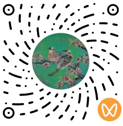

# 李奇安
---

**出生年份**：1966年  
**出生地**：中国湖南  
**毕业院校**：1988年毕业于湖南师范大学美术系  
**现居地**：北京  
**职业**：专职画家  

---

## 个展  

- **2012** 吉光片羽——李奇安作品展，奇安藝術館，北京  
- **2010** “链接”李奇安作品长沙巡展，湖南千年时间当代艺术中心，长沙  
- **2009** “链接”——李奇安个展，798千年时间画廊，北京  
- **2008** “温馨记忆”李奇安油画风景展，湖南文艺家会馆，长沙  

---

## 联展  

- **2014** 艺术无限·未来展，悦·美术馆，北京宋庄  
- **2014** 新年快乐上上艺术展，上上国际美术馆，北京  
- **2013** 湖南油画家精品展，上海虹桥当代艺术馆，上海  
- **2013** 我们的孩子——帮助湖南青年艺术家刘洵之子天天义卖展览，美伦美术馆，长沙  
- **2013** 《艺术为人民》——第二届中国社区艺术巡回展，山水文园古玩沙龙，北京  
- **2013** “我们·1994—2013”——中国宋庄艺术家集群二十周年特展，宋庄美术馆，北京  
- **2013** 自然的盛开——油画作品五人展，泰达图书馆，天津  
- **2012** 艺术·前沿——当代艺术邀请展，宋庄美术馆，北京  
- **2012** “框”里·“框”外——宽度5：当代艺术展，北京当代艺术馆，北京  
- **2012** 中国林州国际友好和平艺术节“和而不同”当代艺术邀请展，中国林州碑林艺术馆，河南  
- **2012** （首届）当代艺术Weibo大展线下实体展，宋庄美术馆，北京  
- **2012** 当代最具学术价值与市场潜力的艺术家邀请展，中国国家画院美术馆，北京  
- **2012** 第27届亚洲国际美术展，查迖蒙当代艺术中心，曼谷，泰国  
- **2011** 颜文樑艺术奖——苏州美术馆年度邀请展，苏州美术馆，苏州  
- **2011** “祈福”——为邹跃进先生捐赠艺术作品展，798艺术区圣之空间艺术中心，北京  
- **2010** 从东营到宋庄——湖南当代艺术展，禾·美术馆，北京  
- **2010** NICAF第26回大韩民国南部国际现代美术大展，天津美术学院美术馆，天津  
- **2009** 流の艺术——中国当代版画展，新光文苑，北京  
- **2009** 我能相信——中国当代艺术家邀请展暨繁星美术馆开幕展，繁星美术馆，北京  
- **2009** 798首届双年展·附件/插入主题展，798艺术区圣之空间艺术中心，北京  
- **2009** “中国情境·重庆驿站”当代艺术大展，501当代美术馆，重庆  
- **2008** 艺术湖南——湖南省美术作品展，中国美术馆，北京  
- **2008** 艺术湖南——湖南省美术作品展，湖南省展览馆，长沙  
- **2004** 第十届全国美展湖南省展区湖南优秀作品展，湖南省展览馆，长沙  
- **2004** 桃源“七黄”当代艺术油画展，湖南师大美术馆，长沙  
- **2004** 常德市首届油画提名展，常德市美术馆，常德  
- **2004** 庆祝中华人民共和国成立五十周年常德市美术作品展，常德市书画院，常德  
- **2004** 湖南省庆祝建国五十五周年书画作品展览，湖南省美术馆，长沙  
- **2003** 首届全国髡残艺术节美术作品展览银奖，常德美术馆，常德  
- **2003** 常德市美术家协会首届会员作品展银奖，湖南文理学院美术展览馆，常德  
- **2002** 常德市纪念毛泽东《在延安文艺座谈会上的讲话》发表60周年美术大展《翠影》获银奖，常德美术馆，常德  
- **1995** 第六届全国书法篆刻展，中国美术馆，北京  

---

## 博物馆及机构收藏

| 机构名称 | 所在城市 | 国家 |
|-----------|------------|-----|
| 苏州美术馆 | 苏州 | 中国 |
| 龙乐艺术机构 | 苏州 | 中国 |
| 汤臣国际 | 上海 | 中国 |
| 中国银行 | 天津 | 中国 |
| 千年时间画廊 | 北京 | 中国 |
| 繁星美术馆 | 北京 | 中国 |
| 慕尼黑保险 | 慕尼黑 | 德国 |
| 尚喜堂 | 长沙 | 中国 |
| 宇然文化 | 北京 | 中国 |
| 君涵画廊 | 广州 | 中国 |
| 华兴彩印 | 深圳 | 中国 |
| 艺术玩家 | 长沙 | 中国 |
| 林凤眠艺术馆 | 广州 | 中国 |
| 包商银行 | 北京 | 中国 |

---
# 联系
> 联系作者
> 微信号: `liqian9365`

